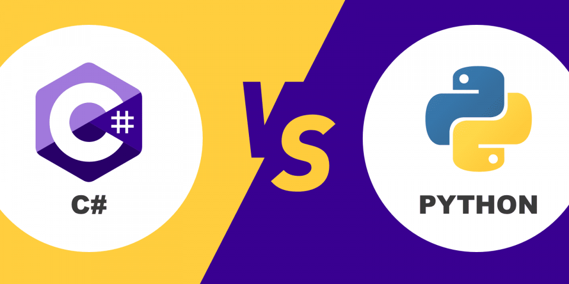

# Language Infrastructures Comparison 🌐

## 1. C# Common Language Infrastructure (CLI) 🛠️

### Components:
- **Compiler:** 📝 Converts C# code into Common Intermediate Language (CIL).
- **Common Language Runtime (CLR):** 🌐 Provides a runtime environment that runs the CIL code, handling memory management, security, exception handling, etc.
- **Just-In-Time (JIT) Compiler:** ⚙️ Translates the CIL code into native machine code just before execution.

### Execution Process:
- C# code is first compiled into CIL, which is a CPU-independent set of instructions. 🖥️
- When a C# program is executed, the CLR takes over and executes the CIL code. 🚀
- The JIT compiler compiles CIL into native code for the specific architecture it's running on. 💻

### Key Features:
- Strong type safety 🔒
- Automatic memory management (garbage collection) 🗑️
- Cross-language interoperability within the .NET languages 🤝
- Security mechanisms like code access security 🔐

## 2. Python Infrastructure 🐍

### Components:
- **Interpreter:** 📘 Python uses an interpreter to execute the Python source code directly.
- **Python Virtual Machine (PVM):** 💡 Acts as a runtime engine for Python, similar to the CLR in C#. It's part of the Python interpreter.

### Execution Process:
- Python source code is first compiled into a bytecode, which is a lower-level, platform-independent representation of the source code. 📚
- This bytecode is then interpreted by the Python interpreter, or more specifically, executed by the PVM. 🏃‍♂️

### Key Features:
- Dynamic typing as opposed to C#'s static typing 🔄
- Automatic memory management, but with a different garbage collection mechanism compared to C# 🔄
- Emphasis on readability and simplicity in syntax ✨
- Extensive standard library and third-party modules for various tasks 📚

___
## Comparison 📊

- **Compilation vs Interpretation:** C# compiles code to CIL and then uses JIT for execution, while Python interprets bytecode. 🆚
- **Type System:** C# is statically typed, while Python is dynamically typed. 📊
- **Memory Management:** Both use automatic memory management, but the underlying mechanisms differ. 🧠
- **Interoperability:** C# has strong interoperability within the .NET framework, while Python's simplicity allows for easy integration with other languages through various tools. 🌉
