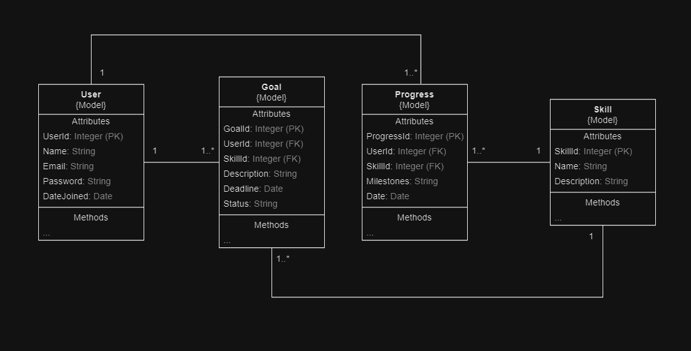
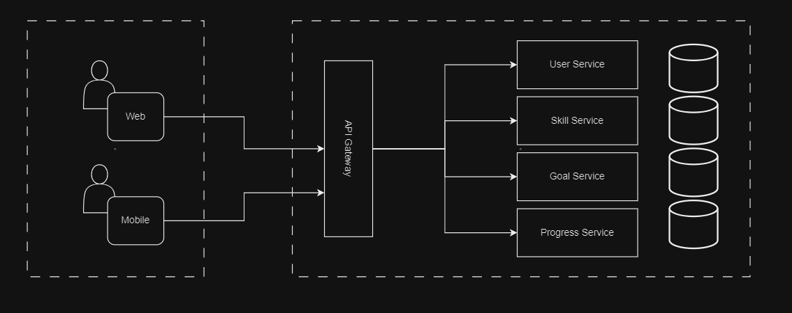

# Homework

## Design an Application for Skill Mastery

The task is to design (not code) an application that assists users in achieving mastery of a particular skill or set of skills over the course of a year.

### 1. Skill Selection
Users begin by selecting a skill they wish to master throughout the year. Possible skills include:

- Learning a new language
- Mastering a musical instrument
- Becoming proficient in a programming language
- Developing a new athletic skill

### 2. Goal Setting
Users set specific, measurable, and achievable goals pertaining to their chosen skill. Goals may consist of:

- Milestones
- Projects
- Levels of proficiency to reach within the year

### 3. Progress Tracking
The app provides functionality for users to track their progress, which includes:

- Logging achievements
- Completing lessons
- Achieving relevant milestones

### 4. Yearly Summary
At the year's conclusion, the app generates a summary of:

- The user's journey
- Achievements
- Overall progress

This summary can be shared on social media platforms or kept as a personal record.

___ 
## Models

### 1. **User Model**
   - **Attributes**:
     - `UserId` (Primary Key): A unique identifier for each user.
     - `Name`: The name of the user.
     - `Email`: The user's email address, used for login and notifications.
     - `Password`: A hashed version of the user's password (for authentication purposes).
     - `DateJoined`: The date when the user registered on the app.

### 2. **Skill Model**
   - **Attributes**:
     - `SkillId` (Primary Key): A unique identifier for each skill.
     - `Name`: The name of the skill (e.g., "Python Programming", "Guitar").
     - `Description`: A brief description of the skill.

### 3. **Goal Model**
   - **Attributes**:
     - `GoalId` (Primary Key): A unique identifier for each goal.
     - `UserId` (Foreign Key): The identifier of the user who set the goal.
     - `SkillId` (Foreign Key): The identifier of the skill related to the goal.
     - `Description`: A detailed description of the goal.
     - `Deadline`: The target date to achieve the goal.
     - `Status`: Indicates the current status of the goal (e.g., "Not Started", "In Progress", "Completed").

### 4. **Progress Model**
   - **Attributes**:
     - `ProgressId` (Primary Key): A unique identifier for each progress entry.
     - `UserId` (Foreign Key): The identifier of the user who is making progress.
     - `SkillId` (Foreign Key): The identifier of the skill being learned.
     - `Milestones`: Key achievements or milestones reached in the skill development.
     - `Date`: The date when the progress entry was made.

### Relationships Between Models:

1. **User and Goal**:
   - One-to-Many: A single user can set multiple goals. Each goal is associated with one user.

2. **User and Progress**:
   - One-to-Many: A user can have multiple progress records. Each progress record is linked to one user.

3. **Skill and Goal**:
   - One-to-Many: A particular skill can be associated with multiple goals from different users.

4. **Skill and Progress**:
   - One-to-Many: A skill can have multiple progress records associated with it from different users.

## UML Diagram

## Architecture Diagram
