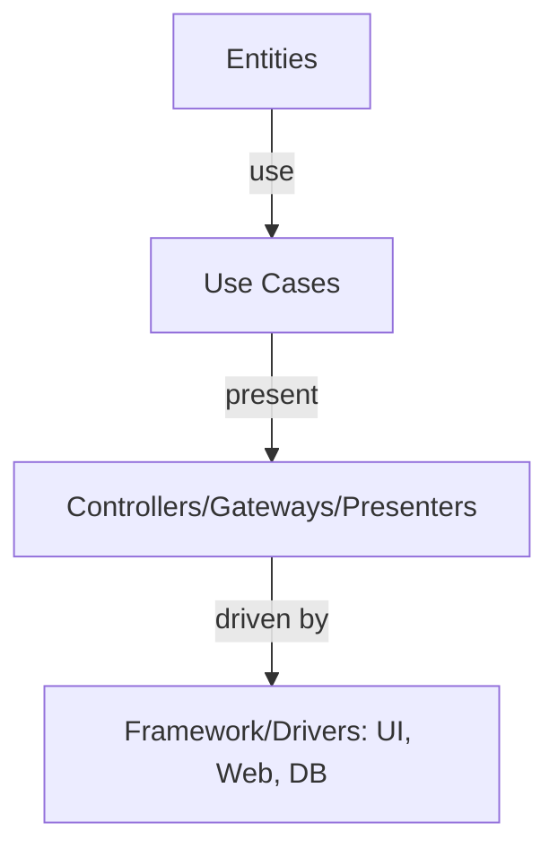
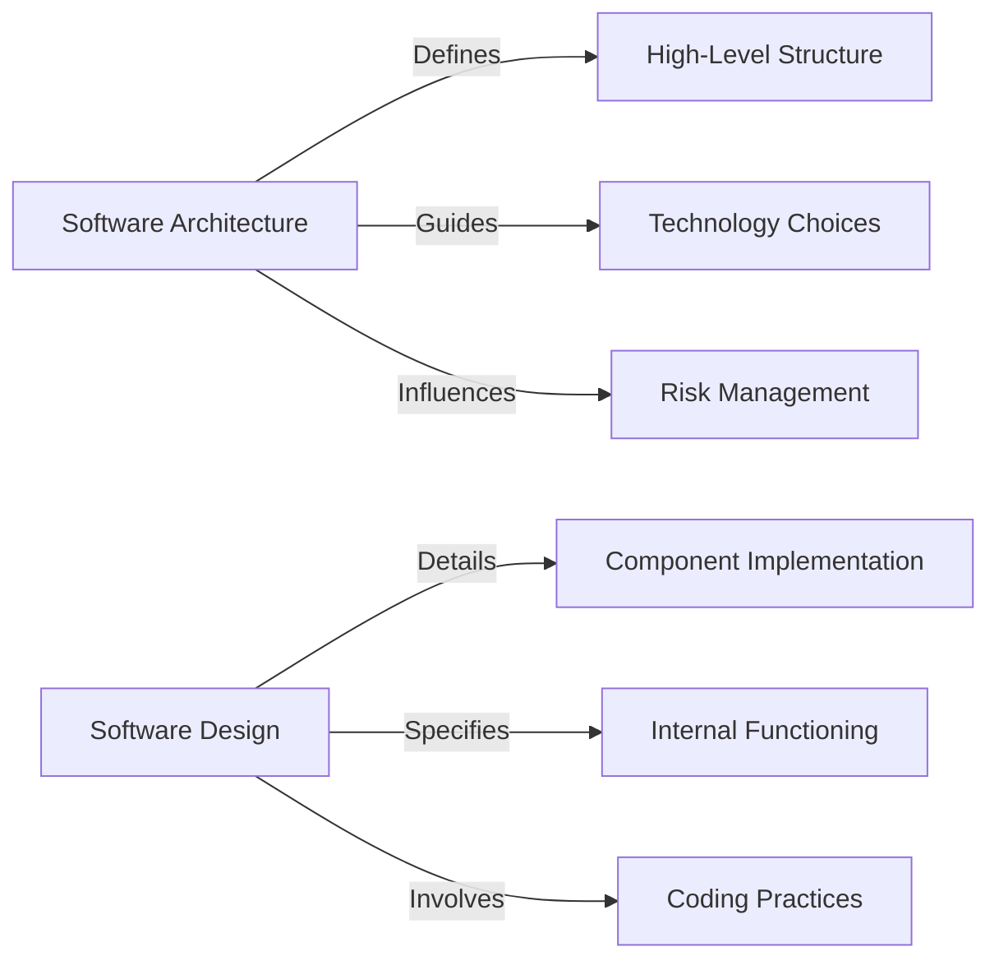

### What is Software Architecture, and Why is It Important in the Development Process?

Software architecture refers to the high-level structuring of a software system, involving the selection of structural elements and their interfaces, as well as the behavior as specified in collaborations among those elements. 

In more informal words, It's akin to a blueprint for a building.

#### Importance:
1. **Framework for System Design**: It provides a structured framework, guiding the development process and ensuring that the end product meets the requirements.
2. **Facilitates Scalability and Performance**: Good architecture allows the system to scale effectively and efficiently.
3. **Improves Quality and Maintenance**: It enhances the maintainability and quality of the software, reducing the cost of future modifications.

### Difference Between Architecture and Design in Software Development

- **Software Architecture**:
  - High-level structure.
  - Focuses on how major parts of the software interact with each other.
  - Comparable to the layout of a building.

- **Software Design**:
  - More detailed and focused.
  - Concentrates on the implementation details of individual components.
  - Similar to the design of individual rooms in a building.

**Comparison:**

| **Aspect** | **Architecture** | **Design** |
|------------|------------------|------------|
| Focus      | High-level structure and behavior of software components. | Detailed implementation and functionality of individual components. |
| Scope      | Broad, covers the entire system. | Narrower, focuses on specific parts. |
| Impact     | Long-term, affecting system's overall structure. | Short-term, affects how individual components operate. |

### Role of Software Architecture Throughout the Software Development Lifecycle

1. **Planning and Analysis**: Helps in understanding the system requirements and constraints.
2. **Development**: Guides the development team in implementing the system.
3. **Testing**: Ensures the system aligns with the architectural requirements.
4. **Maintenance**: Facilitates easier modifications and updates.

### Applying Clean Architecture in a Practical Scenario

- **Scenario**: Building a Web Application
  - **Independent of Frameworks**: The architecture does not depend on the existence of some library.
  - **Testable**: Business rules can be tested without the UI, Database, Web Server.
  - **Independent of UI**: The UI can change easily without changing the rest of the system.
  - **Independent of Database**: You can swap out SQL Server for MongoDB without much trouble.
  - **Independent of any external agency**: Business rules don’t know anything at all about the outside world.

### Advantages and Challenges of Adopting Clean Architecture

#### Advantages:
1. **Flexibility**: Easy to adapt to changes in technology or design.
2. **Maintainability**: Simplifies updates and maintenance.
3. **Testability**: Facilitates comprehensive testing.

#### Challenges:
1. **Learning Curve**: Can be complex for new team members.
2. **Initial Development Time**: Might require more time initially to set up.
3. **Overengineering**: Risk of overcomplicating simple solutions.

### Visual Representation: Clean Architecture
*This diagram represents a simplified view of the Clean Architecture, illustrating its layered approach and flow of control.*

### Visual Representation: Software Architecture vs. Design

*This diagram illustrates the distinct roles of software architecture and design in software development, highlighting their unique focus areas and impacts.*

